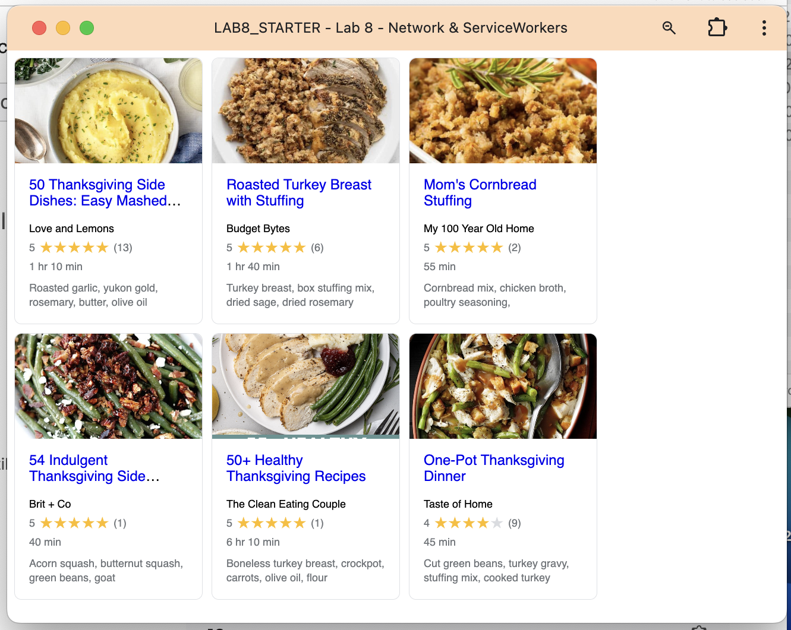

# Lab8-Starter
Team: Fnu Anu (Solo)

Link: https://fnuanu1.github.io/Lab8_Starter/

How are service workers and graceful degradation related?
- Both aim to keep the app functional even when advanced features aren’t available.
- Graceful degradation starts with full tech (JS, CSS) and works down gracefully.
Service workers add features like offline support and caching — but the app still works if they fail or aren't supported.
- Together, they help build more resilient and accessible web apps on/offline.

Image: 
