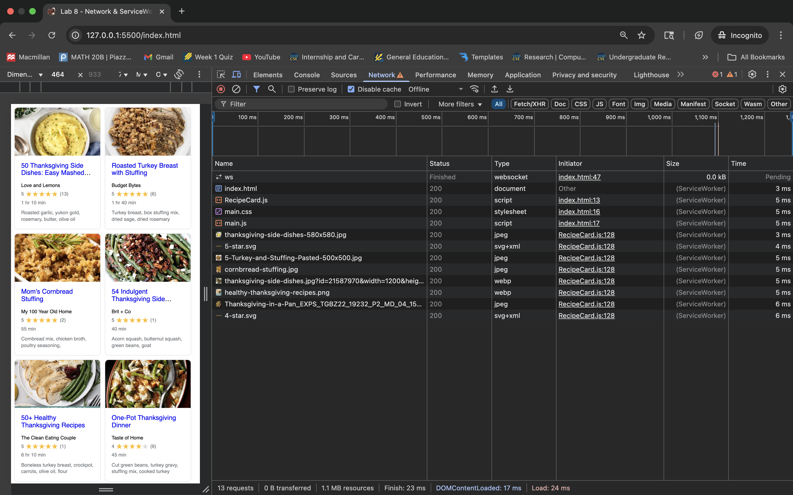

# Lab8-Starter
Team: Fnu Anu (Solo)

Link: https://fnuanu1.github.io/Lab8_Starter/

How are service workers and graceful degradation related?
- Both aim to keep the app functional even when advanced/specific features aren’t available.
- Graceful degradation works down gracefully so we want to have some functionality and keep adding more tedious things so service workers add features like offline support and caching — so the app still works if they fail or aren't supported. Together, they help build more resilient and accessible web apps on/offline.
Image: 
Image: 
Note: My console was throwing some errors, and I had shown a TA, to which they said that those were browser-based unsupporting/supporting errors, which they said are acceptable, so I am showing the picture above about everything working, but they might fail based on browser/incognito, etc. (which is what the TA said was to be unpredictable and being careful about) Hence, I just wanted to make a note, clarifying this issue. Thank you!
